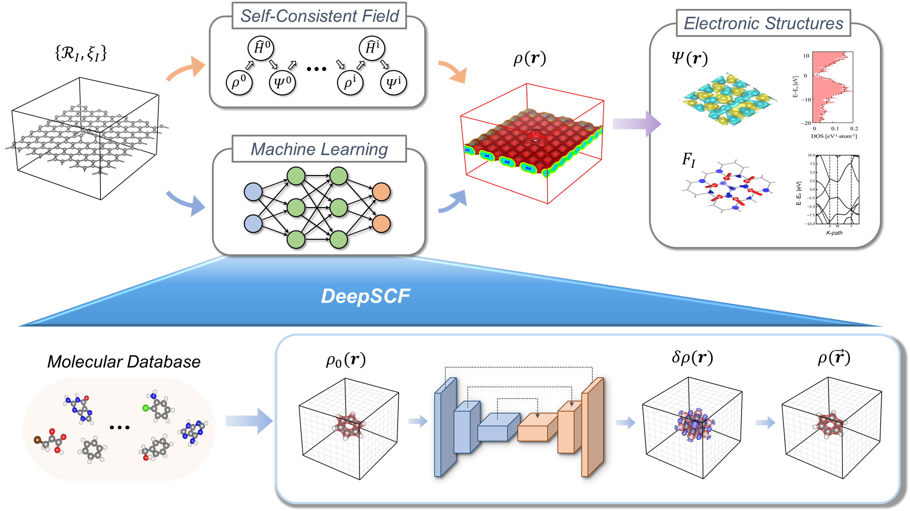

DeepSCF
======
<p align="center">
  
</p>

The DeepSCF is a machine-learning strategy to accelerate the density functional theory (DFT) calculations by learning the map between the self-consistent field (SCF) electron density $\rho$ and the initial guess density $\rho_0$. This repository contains the official implementation as described in the paper: [*Convolutional network learning of self-consistent electron density via grid-projected atomic fingerprints*](https://doi.org/10.1038/s41524-024-01433-0). The implementation employs three-dimensional (3D) convolutional neural networks (CNNs) based on the [U-Net](https://arxiv.org/abs/1505.04597) architecture, using the PyTorch framework.  

## Preperation

### Installation
Run the following command in the path of DeepSCF:
```bash
git clone https://github.com/yhkimlab/DeepSCF.git
cd DeepSCF
```

### Requirements

To use DeepSCF, we recommend setting up an Anaconda environment with Python ≥ `3.7.15`. The following libraries are required:
- torch==1.12.1
- h5py==2.10.0
- hydra-core==1.3.2
- numpy==1.21.5
- omegaconf==2.0.6

You can install these requirements by running
```bash
pip install -r requirements.txt
```

If you plan to use a GPU with PyTorch, ensure that you install the appropriate PyTorch version compatible with your system and CUDA version. Refer to the [PyTorch installation guide](https://pytorch.org/get-started/previous-versions/) for detailed instructions .

### Prepare the dataset 


To train DeepSCF, the dataset for molecular materials must be prepared in the `HDF5` file format. Each `HDF5` file should contain `numpy.array` with the shape of `[feature, x-index, y-index, z-index]`, in which the `feature` axis represents the three-dimensional distributions of target electron density $\rho$, initial electron density $\rho_0$, and additional features.

Specifically, the `feature` axis should include the following:

 - **First entry**: $\rho$ (*mendatory*)
 - **Second entry**: $\rho_0$ (*mendatory*)
 - **Other entries**: additional features (e.g. $\rho_{ion}$, $\rho_{S}$) (*optional*)

**All feature should be standardized**, except the the $\rho$ feature. For the $\rho_0$, the `mean` and `std` values should be recorded for reconstructing the predicted electron density (see the following **Train DeepSCF** section).  


To obtain these features, one can utilize SIESTA program. The $\rho$ (stored in `.RHO` file) can be generated by performing SIESTA calculation with the `SaveRho` option set to `true`. It should be noted that the $\rho_0$ and the other feature cannot be obtained directly from the original SIESTA program. They can only be generated by modifying the SIESTA source code. All SIESTA grid objects are stored in Fortran unformatted format. To convert them into `numpy.array` for generating dataset, one can utilze the `utils/siestaio.py`.  

**Note**
Specially, the $\rho_0$ can be indirectly obtained by substracting the $\delta\rho$ (stored in `.DRHO` file), which can be generated by SIESTA calculation with the `SaveDeltaRho` option set to `true`, from the $\rho$ using the relation $\rho_0=\rho-\delta\rho$.  

In the original paper, datasets were generated from the [TABS database](https://www.sciencedirect.com/science/article/pii/S2210271X14002400). The input and target feature used for the Org model can be found at https://doi.org/10.5281/zenodo.10075554.


## Train DeepSCF  

Training **DeepSCF** is easily managed using `hydra`. The default values for the input configuration are already set in the `config/train.yaml` file. Below is an overview of the key configuration features:

**Hydra**  
- **`run.dir`**: Defines the directory where training results will be saved. The folder can be structured by date and time (e.g., `./results/train/2024-11-26/14-30-45`), or you can specify a custom path name.  

**Dataset**  
- **`path`**: Specifies the path to the dataset containing the `HDF5` files for materials.
- **`augmentation`**: Indicates the augmentation configuration.
- **`batch_size`**: Number of samples per batch. Default is `1`.  
- **`ratio`**: Split ratio for training and validation datasets. A value of `0.8` means 80% of the data is used for training, and 20% for validation/testing.  

**Model**  
- **`mean`**: Mean value for $\rho_0$ in the input features.  
- **`std`**: Standard deviation for $\rho_0$ in the input features


One can modify the `config/train.yaml` file and start the training process using the following commend:

```bash
python train.py
```

Alternatively, you can manually override specific configurations directly in the command line. For example:

```bash
python train.py dataset.path='dataset/1.TABS/1.Augmentation_x1'
```

## Predict with DeepSCF

Once the training have been done, the `model.pt` file will be generated. Based on this trained model, one can predict $\rho$ for any material by providing its input feature. To start prediction, the `config/predict.yaml` files shoud be specified. Below are the key configuration features:

**Load**  
- **`path`**: Path to the pre-trained model to be used for prediction (e.g.`./results/train/2024-11-26/14-30-45/model.pt'`). 

**Model**  
- All configuration settings should be same with those used for using the pre-trained model

**target** 
- **`path`**: Path to the target data file for prediction. This can either (1) the `data.pkl` file in the trained directory for the evalutation set used during the training, (2) the path of `HDF5` file for input feature of specific material, or (3) the path where serveral `HDF5` files are loacted.
- **`cell`**: Defines the lattice vectors of the simulation cell in `Bohr` unit. This does not necessarily describe the full case but rather serves as a reference for a specific material.
- **`mesh`**: Specifies the number of grid points along the x-, y-, and z-directions corresponding to the simulation box defined by `cell`.

One can modify the `config/train.yaml` file and start the prediction process using the following commend:
```bash
python predict.py
```

Then, the predicted $\rho$ for each material will be stored in in SIESTA `grid object` based on the `sietaio.py` module.

## Predict electronic structures with DeepSCF

After obtaining the $\rho$ in the SIESTA `grid object` format, the electronic structures can be also predicted by performing a single-shot self-consistent field (SCF) calculation. The original SIESTA does not natively support to read the $\rho$ for setting it as initial condition. To enable this functionality, the SIESTA `dhscf.F` source code can be modified to read the SIESTA `grid object` at the intial stage of SCF calculation, utilizing the `readGrid()` subroutine. Then, perform the DFT calculation with the `MaxSCFIterations` option set to 1.

## How to cite
If you want to use DeepSCF, please cite:

```
@article{deepscf,
   author = {Lee, Ryong-Gyu and Kim, Yong-Hoon},
   title = {Convolutional network learning of self-consistent electron density via grid-projected atomic fingerprints},
   journal = {npj Computational Materials},
   volume = {10},
   number = {1},
   pages = {248},
   ISSN = {2057-3960},
   DOI = {10.1038/s41524-024-01433-0},
   url = {https://doi.org/10.1038/s41524-024-01433-0},
   year = {2024},
   type = {Journal Article}
}
```
